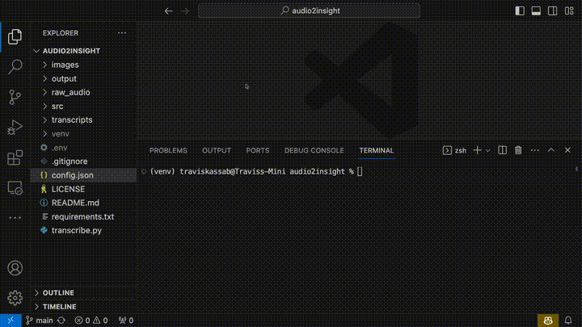
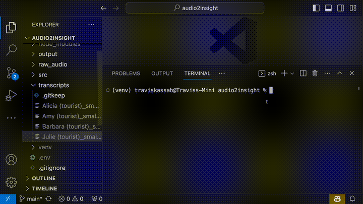
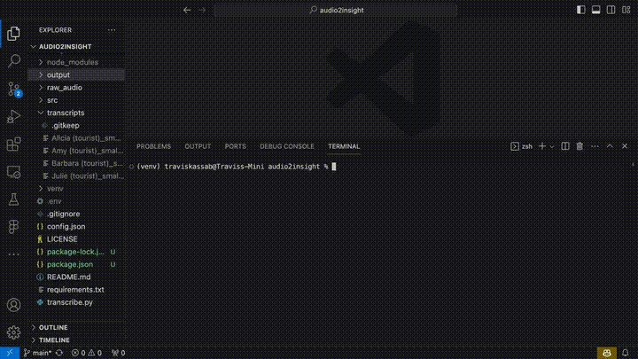

# audio2insight


**audio2insight** is an open-source project that automates qualitative data analysis, and was built specifically for UX Researchers, Market Researchers, and Academics who conduct one-on-one, in-depth interviews.

As the name suggests, **audio2insight** covers the full analytical pipeline starting with audio files from interviews and ending with AI making sense of the data. First, audio files are converted into timestamped and speaker-labeled transcripts. Then the researcher can either talk to, and ask bespoke questions of, a specific transcript. Or, can run many transcripts through the entire discussion guide, which results in structured interview data for an entire study. 

In either case, OpenAI LLMs answer questions based on the specific information contained within your interviews. You can think of it like chatGPT, but with an awareness of your qualitative research data. This toolset is intended to speed up analysis by automating mundane data processing, and amplify human researchers in general.

Note: Installation and usage of **audio2insight** requires some familiarity with the command-line interface. I did my best to create a step-by-step guide for those who are not technically-minded.

**Get started by** cloning the repo, and changing into the folder:
```
gh repo clone tmk1221/audio2insight
cd audio2insight
```

## 1 - Transcribe interviews (optional)
Transcription converts your interview audio files into time-stamped, speaker-labeled transcripts.



Note: The installation below is by far the most complex part of this entire project. You can skip all of #1 if you have another method for obtaining interview transcripts.

### 1.1 Setup
These installation instructions are for MacOS. Install [Homebrew Package Manager](https://brew.sh/) if you don't already have it.

1. Install Python3.10 - this specific version is highly recommended for running the transcription model
    ```
    brew install python@3.10
    ```

2. Install `virtualenv` Python package manager, and create a virtual environment for Python3.10
    ```
    !pip install virtualenv
    python3.10 -m venv venv
    source venv/bin/activate
    ```

3. Install the necessary Python dependencies
    ```
    pip install -r requirements.txt
    ```

    You may also need to install ffmpeg, Rust, etc. See OpenAI instructions [here](https://github.com/openai/whisper#setup).

4. Create a free Hugging Face account [here](https://huggingface.co/join?next=%2Fsettings%2Ftokens).

5. Once you have a Hugging Face account, create an Access Token (read) [here](https://huggingface.co/settings/tokens).

6. Create a file named `.env` in the root directory of your project. In the file, paste in your token like so.

    

7. Finally, agree to the conditions of the following three models
    - [Segmentation](https://huggingface.co/pyannote/segmentation)
    - [Voice Activity Detection](https://huggingface.co/pyannote/voice-activity-detection)
    - [Speaker Diarization](https://huggingface.co/pyannote/speaker-diarization).


### 1.2 Usage
1. Place `.wav` audio files from your user interviews in the `./raw_audio` folder.
    
    Often virtual meeting recordings will output video files, or another audio format like `.mp3`. There are free online converters for changing these files into `.wav`. [Convertio](https://convertio.co/) has been helpful for me.

2. Update the following variables in the `./config.json` file
    1. `whisper_model`: The Whisper model used for transcription (see the models below)
        
        There are accuracy and speed tradeoffs. I recommend using `small.en`. With my 2020 Mac Mini CPU's, I achieved 2x speed and it was plenty accurate. "2x speed" meaning it takes about 30 minutes to transcribe an hour of audio.


        | Model Name          | Required VRAM  | Relative speed  |
        | ------------------- | -------------- | --------------- |
        | tiny.en             | ~1 GB          | ~32x            |
        | base.en             | ~1 GB          | ~16x            |
        | small.en            | ~2 GB          | ~6x             |
        | medium.en           | ~5 GB          | ~2x             |
        | large-v2            | ~10 GB         | 1x              |


    2. `number_of_speakers`: The number of speaker voices present in the audio
        
        This is needed because the final trancript is speaker-labeled. For example, in an in-depth interview, the number of speakers would be 2 - one for the moderator and one for the research participant.

    3. `device`: The hardware used for computation (either "cpu" or "cuda")
        
        I could only get "cpu" working on my Mac Mini. Aparently M1 GPUs are not supported by the model. Windows and Linux users should be able to take advantage of their local GPUs (to speed up processing) by changing `device` to "cuda".
 
    You can ignore the other variables in `./config.json` for now. These will be changed in later sections.

3. Run transcription - this will transcribe all `.wav` files in the `./raw_audio` folder
    ```
    python3 transcribe.py
    ```

    [OpenAI's Whisper](https://github.com/openai/whisper) (Speech Recognition Model), and some other open-source models, will temporarily download to your machine. These models are all run on your local hardware and are free of cost.

    The following warning messages get printed to my console after running transcribe. These can be disregarded. I don't have a technical reason for why, but the transcript quality 'speaks' for itself 😉.

    ```
    Lightning automatically upgraded your loaded checkpoint from v1.5.4 to v2.0.9.post0. To apply the upgrade to your files permanently, run `python -m pytorch_lightning.utilities.upgrade_checkpoint --file ../.cache/torch/whisperx-vad-segmentation.bin`
    Model was trained with pyannote.audio 0.0.1, yours is 3.0.0. Bad things might happen unless you revert pyannote.audio to 0.x.
    Model was trained with torch 1.10.0+cu102, yours is 2.0.0. Bad things might happen unless you revert torch to 1.x.
    ```

4. Transcribed interviews are placed in the `./transcripts` folder, ready for the following AI Research Assistant.

## 2. AI Research Assistant
### 2.1 Setup
Install [Node.js](https://nodejs.org/) (LTS) on your system if you don't already have it. You can check if you do with `node --version`.

1. Create an OpenAI account, then create an API key [here](https://platform.openai.com/account/api-keys).

2. If you haven't already, create a `.env` file in your project's root directory, and add the OpenAI API key to it, as shown below.

    

3. Install Node dependencies.
    ```
    npm install ./src/
    ```

4. Update the `openai_model` variable in `./config.json` file. This is the OpenAI Large Language Model (LLM) used for all subsequent analyses.

    At the time of writing, the most common options are: "gpt-3.5-turbo" or "gpt-4". GPT-4 is a more powerful model, but will cost more to use. For up-to-date information about available models, see [OpenAI's Model Overview](https://platform.openai.com/docs/models/overview)

5. If you haven't done so already, add interview transcripts (must be .txt files) into the `./transcripts` folder. The AI 'looks' here to access your interview data.

    You can transcribe your audio with WhisperX, as detailed above; however, this is not required. If you already have trancsripts from another source then manually add them into the `./transcripts` folder.

### 2.2 Usage
There are two ways the AI Research Assistant can be used. First, it can generate structured data for an entire study. It creates a table of user responses for each question in your discussion guide, for each user in your study.



#### 2.2.1 Structured Interview Data 
1. Update the `discussion_guide` variable in the `./config.json` file. These questions should match the questions that were asked in the interviews, and which are present in the transcripts.

    Phrase these questions in the way the moderator asked them to the respondent. The AI will  ask these questions of every transcript in your `./transcripts` folder. The phrasing matters so that the AI can find the relevant parts of the transcript that are needed to answer the question.

2. Run the generator bot
    ```
    node ./src/generate.js
    ```

    The AI's progress will get printed to your console as it asks each question of each transcript.

3. Find the structured interview data (.csv) in the `./output` folder. You can open the file with a spreadsheet application like Numbers or Excel for easy read-out.

    The AI will do its best to find the relevant information in the transcripts in order to answer the questions. If it does not think it has the information needed to answer a question, it will say "I don't know" or "Based on the given context, I cannot provide an answer...". Expect that you will need to tweak the wording of the questions in order to get a desired response.

#### 2.2.2 Talk-To-Transcript
You can also "talk" to a specific transcript. Ask a question of a specific transcript, and the response will immediately print to your console.



In order to talk to a transcript, the command always follows the format below:
```
node ./src/talk.js "name_of_transcript.txt" "put_your_question_here"
```

- The first two arguments (`node ./src/talk.js`) never change.

- The third argument is the name of the transcript (placed in quotes) that you want to talk to. As always this transcript must be located in the `./transcripts` folder.

- Finally, the fourth argument is the question you want to ask the transcript (placed in quotes)

Here is a real-world example:
```
node ./src/talk.js "Alicia (tourist)_small.en.txt" "Tell me about your virtual tour experiences. And how did you hear about them?"
```
```
Based on the conversation, Speaker 00 found out about virtual tours through the London Meetup site. They joined a group called "Undercover France" which normally meets up in person but has moved their activities online due to the lockdown. Speaker 00 mentioned that the virtual tours they have experienced so far have included concerts, discussion groups, and book clubs.
```
